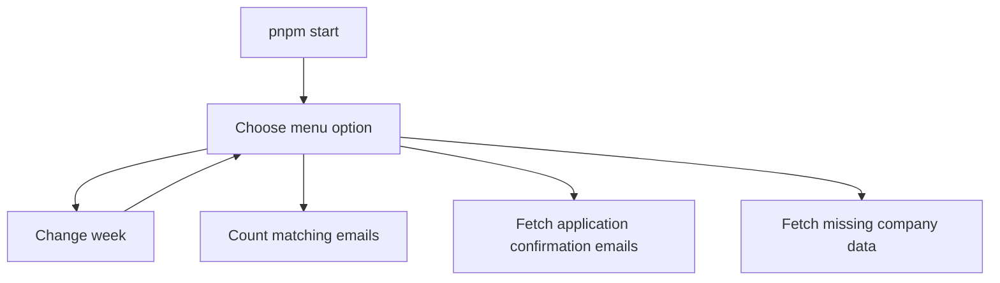
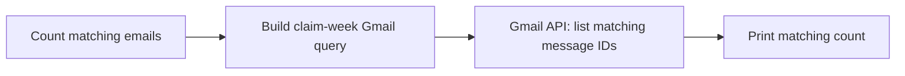
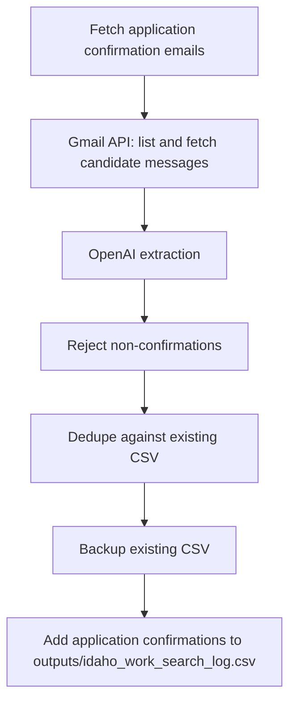
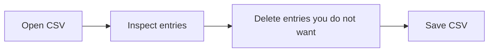
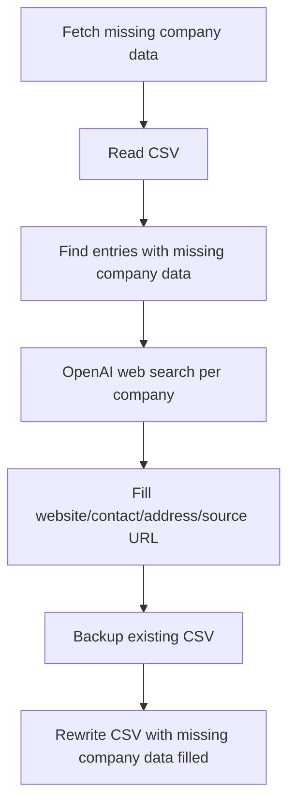

# Work Search Reporter

Local TypeScript CLI for fetching Gmail application confirmation emails, filling missing company data, and maintaining one Idaho work-search CSV:

`/Users/paulterhaar/PROJECTS/jobhunt-26/work-search-reporter/outputs/idaho_work_search_log.csv`

## Quick Start

```sh
pnpm start
```

The interactive menu is the app entrypoint. It lets you count matching emails, fetch application confirmation emails, fetch missing company data, or change the active claim week.



## Setup

The first Gmail run needs a Google OAuth desktop-client JSON file at:

`/Users/paulterhaar/PROJECTS/jobhunt-26/work-search-reporter/google-oauth-client.json`

Create it in Google Cloud by enabling the Gmail API, creating an OAuth client for a desktop app, downloading the JSON, and saving it with that filename. The first run opens a browser authorization page and stores a read-only Gmail token in `cache/gmail-token.json`.

OpenAI is configured with `.env`:

```sh
OPENAI_API_KEY="sk-..."
```

## Services Used

| Menu action | Gmail API | OpenAI extraction | OpenAI web search | CSV read/write |
|---|---:|---:|---:|---:|
| `Count matching emails` | yes | no | no | no |
| `Fetch application confirmation emails` | yes | yes | no | add application confirmation emails |
| `Fetch missing company data` | no | no | yes | fill missing company data |

## Workflows

### Count

Use this to see how many Gmail messages match the broad application-related query for the active week. It does not fetch full email bodies and does not call OpenAI.



### Fetch Application Confirmation Emails

Use this to find application confirmation emails and add them to the CSV. It does not fetch missing company data.



### Review

Open the CSV and delete entries you do not want to report. The entries left in the CSV are the ones used when fetching missing company data.



### Fetch Missing Company Data

Use this after review. It reads the CSV, finds entries with missing company data, and uses OpenAI web search to fill website, contact, address, and source URL fields.



## Command

### `pnpm start`

Interactive menu. No flags.

Menu options:

- `Change week`
- `Count matching emails`
- `Fetch application confirmation emails`
- `Fetch missing company data`
- `Exit`

`Change week` displays the current selection in the menu, then opens an arrow-key submenu with the current week, last completed week, several previous weeks, a manual Sunday start-date entry, and a back option.

The package still has internal `count`, `collect`, and `enrich` scripts because the menu uses them, but they are not intended as separate user-facing commands and do not take flags.

## Code Quality

Biome handles formatting, import organization, and linting. TypeScript still handles typechecking.

```sh
pnpm check
pnpm check:fix
```

`pnpm check` runs Biome and TypeScript. `pnpm check:fix` formats files, organizes imports, and applies safe Biome fixes. Use `pnpm typecheck` only when you want the TypeScript compiler check by itself.

Biome also enforces arrow functions and flags invalid use before declaration, which guards against hoisting mistakes after replacing function declarations with `const` arrow functions. Source files are ordered so top-level declarations appear before their first use.

The shared VS Code settings use Biome as the default formatter, format on save, organize imports on save, and apply safe Biome fixes on save.

## Notes

- Gmail is used only for read-only email search and retrieval.
- OpenAI extraction is used by `collect` to reject non-confirmation emails.
- OpenAI web search is used only by `enrich`.
- `collect` does not fetch missing company data.
- The tool never logs into Idaho's portal and never submits anything.
