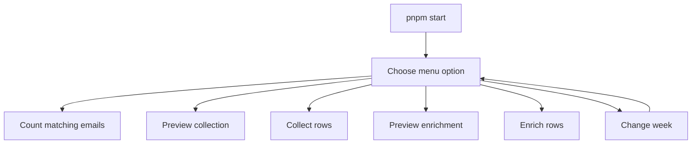
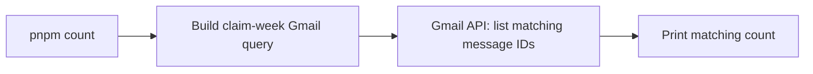
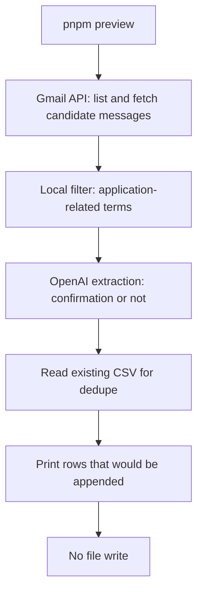
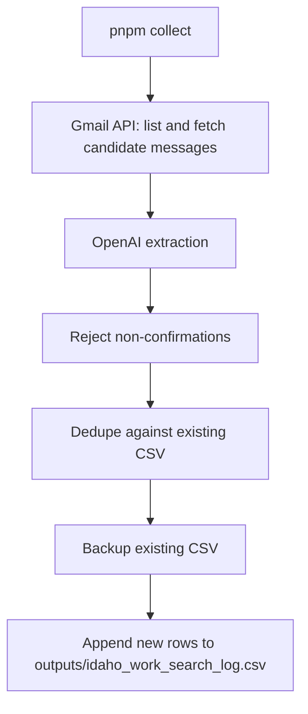
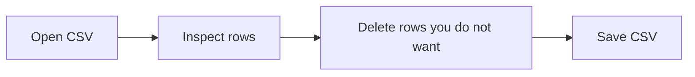
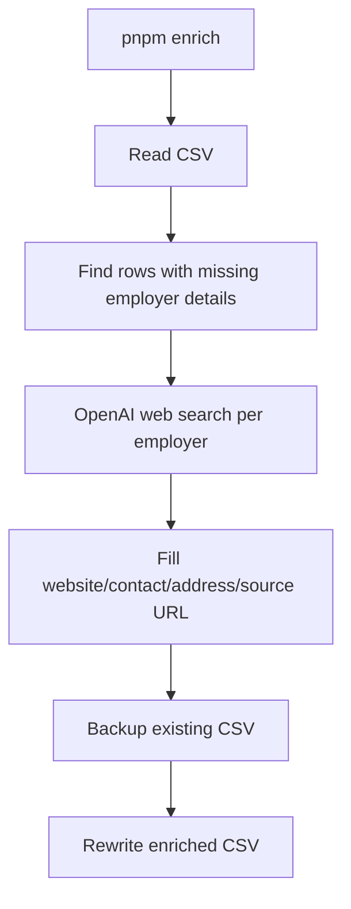

# Work Search Reporter

Local TypeScript CLI for collecting Gmail job-application confirmation emails and maintaining one Idaho work-search CSV:

`/Users/paulterhaar/PROJECTS/jobhunt-26/work-search-reporter/outputs/idaho_work_search_log.csv`

## Quick Start

```sh
pnpm start
```

The interactive menu is the normal entrypoint. It lets you count, preview, collect, preview enrichment, enrich, or change the active claim week.



## Setup

The first Gmail run needs a Google OAuth desktop-client JSON file at:

`/Users/paulterhaar/PROJECTS/jobhunt-26/work-search-reporter/google-oauth-client.json`

Create it in Google Cloud by enabling the Gmail API, creating an OAuth client for a desktop app, downloading the JSON, and saving it with that filename. The first run opens a browser authorization page and stores a read-only Gmail token in `cache/gmail-token.json`.

OpenAI is configured with `.env`:

```sh
OPENAI_API_KEY="sk-..."
```

## Services Used

| Command | Gmail API | OpenAI extraction | OpenAI web search | CSV read/write |
|---|---:|---:|---:|---:|
| `pnpm start` | depends on selected option | depends on selected option | depends on selected option | depends on selected option |
| `pnpm count` | yes | no | no | no |
| `pnpm preview` | yes | yes | no | read existing CSV for dedupe |
| `pnpm collect` | yes | yes | no | append new rows |
| `pnpm enrich -- --dry-run` | no | no | yes | read only |
| `pnpm enrich` | no | no | yes | update rows |

## Workflows

### Count

Use this to see how many Gmail messages match the broad application-related query for the active week. It does not fetch full email bodies and does not call OpenAI.

```sh
pnpm count
```



### Preview Collection

Use this before writing. It fetches candidate emails, sends snippets to OpenAI to decide whether each is an application confirmation, and prints CSV rows that would be appended.

```sh
pnpm preview
```



### Collect

Use this to append new application-confirmation rows. It does not enrich employer addresses.

```sh
pnpm collect
```



### Review

Open the CSV and delete rows you do not want to report. The rows left in the CSV are the rows enrichment will consider.



### Enrich

Use this after review. It reads the CSV, finds remaining rows with missing employer details, and uses OpenAI web search to fill website, contact, address, and source URL fields.

```sh
pnpm enrich -- --dry-run
pnpm enrich
```



## Commands

### `pnpm start`

Interactive menu. No flags.

Menu options:

- `Count matching emails`
- `Preview collection`
- `Collect draft rows`
- `Preview enrichment`
- `Enrich remaining rows`
- `Change week`
- `Exit`

### `pnpm count`

Counts Gmail messages matching the broad application-related query.

Options:

| Option | Value | Default | Description |
|---|---|---|---|
| `--week-start` | `YYYY-MM-DD` | last completed Sunday | Claim week start date. Must be a Sunday for normal Idaho weekly reporting. |
| `--help`, `-h` | none | none | Show command help. |

Examples:

```sh
pnpm count
pnpm count -- --week-start 2026-07-12
```

### `pnpm preview`

Dry-run collection. Prints rows that would be appended.

Options:

| Option | Value | Default | Description |
|---|---|---|---|
| `--week-start` | `YYYY-MM-DD` | last completed Sunday | Claim week start date. |
| `--batch-size` | positive integer | `10` | Number of candidate email snippets sent per OpenAI extraction request. |
| `--limit` | positive integer | no limit | Testing only. Limits Gmail matches before extraction. Do not use for real weekly collection. |
| `--no-openai` | none | off | Disables OpenAI and uses rough local heuristics. Mainly for debugging. |
| `--output` | file path | `outputs/idaho_work_search_log.csv` | CSV path used for dedupe. |
| `--help`, `-h` | none | none | Show command help. |

Examples:

```sh
pnpm preview
pnpm preview -- --week-start 2026-07-12
pnpm preview -- --limit 25
```

### `pnpm collect`

Writes new application-confirmation rows to the CSV.

Options are the same as `pnpm preview`, except it writes unless you pass `--dry-run`.

| Option | Value | Default | Description |
|---|---|---|---|
| `--dry-run` | none | off | Print rows instead of writing. This is what `pnpm preview` uses. |
| `--week-start` | `YYYY-MM-DD` | last completed Sunday | Claim week start date. |
| `--batch-size` | positive integer | `10` | Number of candidate email snippets sent per OpenAI extraction request. |
| `--limit` | positive integer | no limit | Testing only. Do not use for real weekly collection. |
| `--no-openai` | none | off | Disables OpenAI and uses rough local heuristics. |
| `--output` | file path | `outputs/idaho_work_search_log.csv` | CSV output path. |
| `--help`, `-h` | none | none | Show command help. |

Examples:

```sh
pnpm collect
pnpm collect -- --week-start 2026-07-12
```

### `pnpm enrich`

Fills missing employer details for rows that remain in the CSV.

Options:

| Option | Value | Default | Description |
|---|---|---|---|
| `--dry-run` | none | off | Print enriched CSV preview without writing. |
| `--limit` | positive integer | no limit | Enrich only the first `n` matching rows. Useful for testing. |
| `--concurrency` | positive integer | `2` | Number of employer web-search enrichments to run in parallel. |
| `--output` | file path | `outputs/idaho_work_search_log.csv` | CSV path to read/update. |
| `--help`, `-h` | none | none | Show command help. |

Examples:

```sh
pnpm enrich -- --dry-run
pnpm enrich
pnpm enrich -- --limit 2
pnpm enrich -- --concurrency 1
```

## Notes

- Gmail is used only for read-only email search and retrieval.
- OpenAI extraction is used by `preview` and `collect` to reject non-confirmation emails.
- OpenAI web search is used only by `enrich`.
- `collect` and `preview` do not do web enrichment.
- The tool never logs into Idaho's portal and never submits anything.
