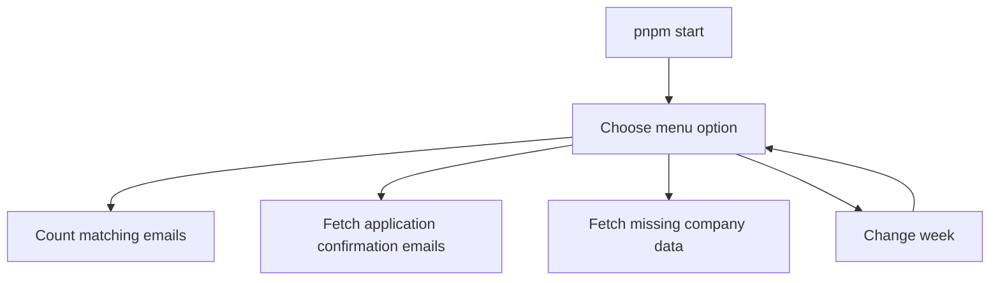
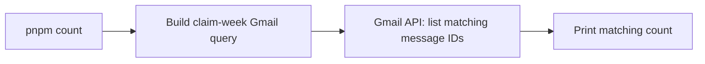
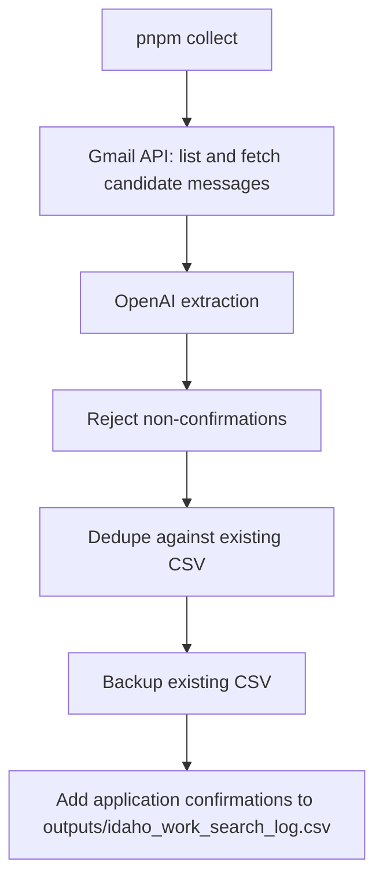
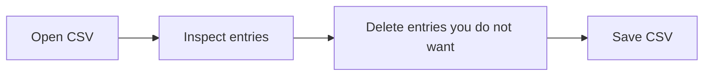
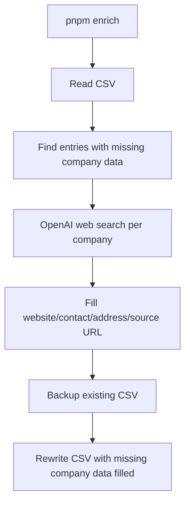

# Work Search Reporter

Local TypeScript CLI for fetching Gmail application confirmation emails, filling missing company data, and maintaining one Idaho work-search CSV:

`/Users/paulterhaar/PROJECTS/jobhunt-26/work-search-reporter/outputs/idaho_work_search_log.csv`

## Quick Start

```sh
pnpm start
```

The interactive menu is the normal entrypoint. It lets you count matching emails, fetch application confirmation emails, fetch missing company data, or change the active claim week.



## Setup

The first Gmail run needs a Google OAuth desktop-client JSON file at:

`/Users/paulterhaar/PROJECTS/jobhunt-26/work-search-reporter/google-oauth-client.json`

Create it in Google Cloud by enabling the Gmail API, creating an OAuth client for a desktop app, downloading the JSON, and saving it with that filename. The first run opens a browser authorization page and stores a read-only Gmail token in `cache/gmail-token.json`.

OpenAI is configured with `.env`:

```sh
OPENAI_API_KEY="sk-..."
```

## Services Used

| Command | Gmail API | OpenAI extraction | OpenAI web search | CSV read/write |
|---|---:|---:|---:|---:|
| `pnpm start` | depends on selected option | depends on selected option | depends on selected option | depends on selected option |
| `pnpm count` | yes | no | no | no |
| `pnpm collect` | yes | yes | no | add application confirmation emails |
| `pnpm enrich` | no | no | yes | fill missing company data |

## Workflows

### Count

Use this to see how many Gmail messages match the broad application-related query for the active week. It does not fetch full email bodies and does not call OpenAI.

```sh
pnpm count
```



### Fetch Application Confirmation Emails

Use this to find application confirmation emails and add them to the CSV. It does not fetch missing company data.

```sh
pnpm collect
```



### Review

Open the CSV and delete entries you do not want to report. The entries left in the CSV are the ones used when fetching missing company data.



### Fetch Missing Company Data

Use this after review. It reads the CSV, finds entries with missing company data, and uses OpenAI web search to fill website, contact, address, and source URL fields.

```sh
pnpm enrich
```



## Commands

### `pnpm start`

Interactive menu. No flags.

Menu options:

- `Count matching emails`
- `Fetch application confirmation emails`
- `Fetch missing company data`
- `Change week`
- `Exit`

### `pnpm count`

Counts Gmail messages matching the broad application-related query.

Options:

| Option | Value | Default | Description |
|---|---|---|---|
| `--week-start` | `YYYY-MM-DD` | last completed Sunday | Claim week start date. Must be a Sunday for normal Idaho weekly reporting. |
| `--help`, `-h` | none | none | Show command help. |

Examples:

```sh
pnpm count
pnpm count -- --week-start 2026-07-12
```

### `pnpm collect`

Fetches application confirmation emails and adds them to the CSV.

| Option | Value | Default | Description |
|---|---|---|---|
| `--week-start` | `YYYY-MM-DD` | last completed Sunday | Claim week start date. |
| `--batch-size` | positive integer | `10` | Number of candidate email snippets sent per OpenAI extraction request. |
| `--limit` | positive integer | no limit | Testing only. Do not use for real weekly collection. |
| `--no-openai` | none | off | Disables OpenAI and uses rough local heuristics. |
| `--output` | file path | `outputs/idaho_work_search_log.csv` | CSV output path. |
| `--help`, `-h` | none | none | Show command help. |

Examples:

```sh
pnpm collect
pnpm collect -- --week-start 2026-07-12
```

### `pnpm enrich`

Fetches missing company data for entries that remain in the CSV.

Options:

| Option | Value | Default | Description |
|---|---|---|---|
| `--limit` | positive integer | no limit | Fetch company data for only the first `n` matching entries. Useful for testing. |
| `--concurrency` | positive integer | `2` | Number of company data lookups to run in parallel. |
| `--output` | file path | `outputs/idaho_work_search_log.csv` | CSV path to read/update. |
| `--help`, `-h` | none | none | Show command help. |

Examples:

```sh
pnpm enrich
pnpm enrich -- --limit 2
pnpm enrich -- --concurrency 1
```

## Notes

- Gmail is used only for read-only email search and retrieval.
- OpenAI extraction is used by `collect` to reject non-confirmation emails.
- OpenAI web search is used only by `enrich`.
- `collect` does not fetch missing company data.
- The tool never logs into Idaho's portal and never submits anything.
