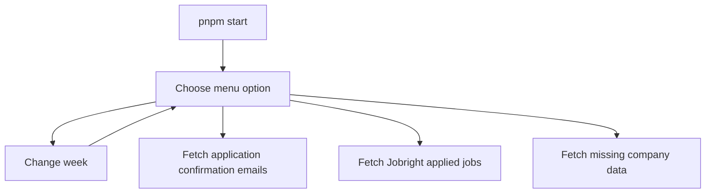
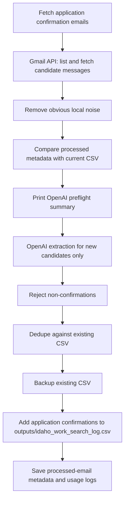
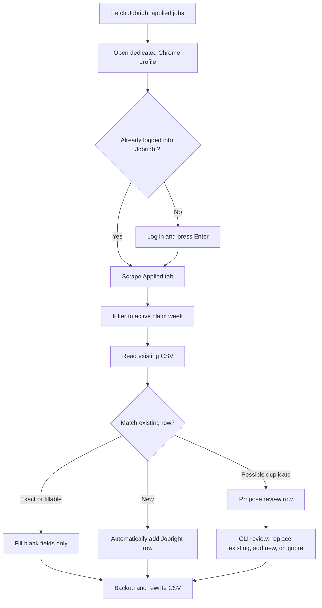
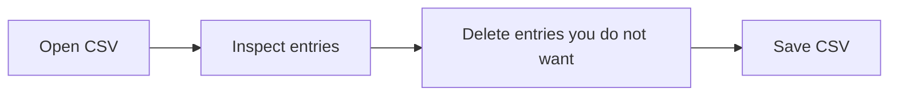
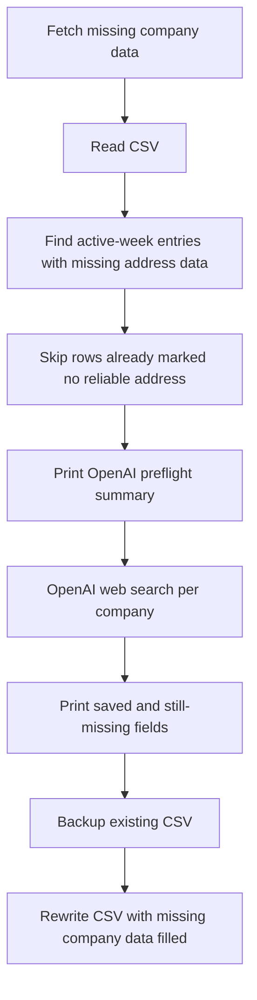

# Work Search Reporter

Local TypeScript CLI for fetching Gmail application confirmation emails, importing Jobright applied jobs, filling missing company data, and maintaining one Idaho work-search CSV:

`/Users/paulterhaar/PROJECTS/jobhunt-26/work-search-reporter/outputs/idaho_work_search_log.csv`

## Quick Start

```sh
pnpm start
```

The interactive menu is the app entrypoint. It lets you change the active claim week, fetch application confirmation emails, fetch Jobright applied jobs, or fetch missing company data for the active week.



## Setup

This app uses two configured services plus one logged-in browser session:

| Service | Used for | Required setup |
|---|---|---|
| Google Gmail API | Read matching messages from your Gmail account. | A Google Cloud project with Gmail API enabled and a desktop OAuth client JSON file. |
| OpenAI API | Classify application-confirmation emails, extract structured fields, and fetch missing company data from the web. | An OpenAI API key stored in `.env`. |
| Jobright | Read your Applied tab when you choose the Jobright import. | Log in once in the dedicated browser window opened by the app. |

The app stores credentials, browser profile data, and generated data locally. `.env`, `google-oauth-client.json`, `cache/`, `outputs/`, and `backups/` are ignored by git.

### Tampermonkey Form Helpers

Browser form helpers live in `tampermonkey/`. They are separate from the CLI and are meant to fill Idaho certification pages only after you click a helper button. They never click `Next`, `Submit`, or final certification controls.

Start with `tampermonkey/idaho-weekly-certification-helper.user.js`. It currently supports Step 1, Work Availability; Step 2, Income; Step 3 work-search action CSV import/fill helpers; and final Submit-page acknowledgement boxes. See `tampermonkey/README.md` for install and testing notes.

### Google Gmail API

The Gmail API lets the app search and read email from the account you authorize. It is used by:

- `Fetch application confirmation emails`

The first Gmail run needs a Google OAuth desktop-client JSON file at:

`/Users/paulterhaar/PROJECTS/jobhunt-26/work-search-reporter/google-oauth-client.json`

To set it up:

1. Create or choose a Google Cloud project.
2. Enable the [Gmail API](https://developers.google.com/workspace/gmail/api/quickstart/nodejs#enable_the_api).
3. Configure the OAuth consent screen in Google Auth Platform.
4. Create an OAuth client with application type `Desktop app`.
5. Download the client JSON and save it as `google-oauth-client.json` in this project folder.

On first use, the app opens a browser authorization page. Sign in with the Gmail account you want to search, then approve access. The app requests the Gmail readonly scope, `https://www.googleapis.com/auth/gmail.readonly`, which Google describes as permission to view Gmail messages and settings. The resulting token is stored locally at `cache/gmail-token.json` so you do not need to authorize every run.

The app does not ask Gmail for send, modify, compose, or delete permissions.

Useful Google docs:

- [Gmail API Node.js quickstart](https://developers.google.com/workspace/gmail/api/quickstart/nodejs)
- [OAuth 2.0 for desktop apps](https://developers.google.com/identity/protocols/oauth2/native-app)
- [Google API OAuth scopes](https://developers.google.com/identity/protocols/oauth2/scopes)

### OpenAI API

The OpenAI API is used by:

- `Fetch application confirmation emails`, to decide whether a candidate email is actually an application confirmation and to extract structured fields like company, job title, action date, and evidence excerpt.
- `Fetch missing company data`, to use OpenAI's hosted web search tool to find missing employer mailing addresses for active-week CSV rows. The response may also fill website, contact, source URL, confidence, and notes when available.

Create an API key in the [OpenAI API dashboard](https://platform.openai.com/api-keys), then create `.env` from `.env.example`:

```sh
cp .env.example .env
```

Add your key:

```env
OPENAI_API_KEY="sk-..."
```

The app loads the key from `.env` only. Do not commit `.env`; it is ignored by git. OpenAI recommends keeping API keys secret and loading them from environment variables or server-side key management.

Optional model overrides can also be set in `.env`:

```env
OPENAI_EXTRACT_MODEL="gpt-5.6-luna"
OPENAI_ENRICH_MODEL="gpt-5.6-terra"
```

By default, email extraction uses `gpt-5.6-luna`, a lower-cost model for
structured classification and extraction from short snippets. Missing company
data enrichment uses `gpt-5.6-terra`, which is more capable for web-search
address lookup while avoiding the bare `gpt-5.6` alias.

Before OpenAI calls, the CLI prints a preflight summary with candidate or row
counts, model, batch/concurrency settings, and an approximate input size. Large
runs show a warning but do not add another confirmation step.

`OPENAI_API_KEY` is required for both fetching application confirmation emails and fetching missing company data.

Useful OpenAI docs:

- [API authentication](https://developers.openai.com/api/reference/overview#authentication)
- [Responses API](https://developers.openai.com/api/reference/resources/responses/methods/create)
- [Structured Outputs](https://developers.openai.com/api/docs/guides/structured-outputs)
- [Web search tool](https://developers.openai.com/api/docs/guides/tools-web-search)
- [Cost optimization](https://developers.openai.com/api/docs/guides/cost-optimization)

### Jobright Browser Session

The Jobright import reads the Applied tab through Playwright and a dedicated local Chrome profile stored at:

`/Users/paulterhaar/PROJECTS/jobhunt-26/work-search-reporter/cache/jobright-browser`

It is used only by:

- `Fetch Jobright applied jobs`

On first use, the app opens a Chrome window to Jobright. Log in, open the Applied tab if needed, then press Enter in the terminal. The session is saved in `cache/jobright-browser` so later runs can reuse it. This profile is separate from your everyday Chrome profile.

The Jobright import reads job title, company, applied date, and the best available Jobright URL. It filters those jobs to the active claim week, reconciles them with the existing CSV, automatically adds non-conflicting new rows, and asks you only how to handle possible duplicates before writing anything.

### What Leaves Your Machine

The CSV, backups, Gmail token, OAuth client JSON, processed-email metadata cache, OpenAI usage metadata log, and `.env` stay local. The app sends limited data to external services:

- Google receives Gmail API requests for the selected claim-week search query and matching message reads.
- OpenAI extraction receives only candidate email metadata and a trimmed evidence excerpt.
- OpenAI web search receives employer/job details from active-week CSV rows that are missing report-critical mailing address data.
- Jobright receives normal browser traffic from the dedicated Playwright Chrome profile when the Jobright import runs.

The processed-email cache is stored at `cache/processed-email-extractions.json`. It stores identifiers, subject, sender, received/sent dates, claim week, whether extraction wrote a row or found no action, and processed timestamp. It does not store email bodies, evidence excerpts, attachments, or OpenAI responses.

When `Fetch application confirmation emails` runs, cached emails are skipped only if they are still represented in the current CSV or were previously classified as no-action messages. If you manually delete an email-derived CSV row, that email can be resent to OpenAI and rebuilt during a retest. Delete `cache/processed-email-extractions.json` only when you intentionally want to clear all processed-email history, including no-action decisions.

The OpenAI usage log is stored at `cache/openai-usage-log.jsonl`. It stores
metadata only: command, model, candidate or row counts, approximate input size,
and token totals when OpenAI reports them. It does not store prompts, email
bodies, CSV row contents, API keys, or secrets.

The app never logs into Idaho's portal and never submits anything.

## Services Used

| Menu action | Gmail API | Jobright browser | OpenAI extraction | OpenAI web search | CSV read/write |
|---|---:|---:|---:|---:|---:|
| `Fetch application confirmation emails` | yes | no | yes | no | add application confirmation emails |
| `Fetch Jobright applied jobs` | no | yes | no | no | add new rows and review possible duplicates |
| `Fetch missing company data` | no | no | no | yes | fill missing mailing addresses for active-week rows |

## Workflows

### Fetch Application Confirmation Emails

Use this to find application confirmation emails and add them to the CSV. It does not fetch missing company data.

After local obvious-noise filtering and OpenAI extraction succeed, the app records processed email metadata locally. Future runs compare that cache with the current CSV before OpenAI: email-derived rows that still exist are skipped, manually deleted rows can be rebuilt, and emails previously rejected as non-confirmations stay skipped.



### Fetch Jobright Applied Jobs

Use this to import jobs from Jobright's Applied tab. It does not call Gmail or OpenAI.

If you use both Gmail and Jobright for the same claim week, run `Fetch application confirmation emails` first, then run `Fetch Jobright applied jobs`. The Gmail pass creates rows from confirmation emails, and the Jobright pass can fill or replace those rows with Jobright's more complete company, title, date, and source data during reconciliation.



Jobright reconciliation keeps manual CSV edits intact:

- Exact match: same normalized company, job title, and action date.
- Fillable match: same date plus matching company or title where the CSV row has a blank field.
- Possible duplicate: same week/date with similar company or title, but not enough confidence to merge.
- New row: no reasonable match found.

For exact and fillable matches, only blank CSV fields are filled automatically. Possible duplicates are reviewed in the CLI before they are written, so you can replace the existing CSV row with the Jobright row, add the Jobright row as a separate application, or ignore the Jobright row. Non-conflicting new Jobright rows are added automatically. After writing, the CLI prints row-level details showing what was added, what changed, and what was ignored.

### Review

Open the CSV and delete entries you do not want to report. The entries left in the CSV are the ones used when fetching missing company data.



### Fetch Missing Company Data

Use this after review. It reads the CSV, finds active-week entries with missing report-critical address data, and uses OpenAI web search to fill mailing address fields. The OpenAI response can also fill website, contact, source URL, confidence, and notes when available, but missing website or contact fields alone do not trigger a lookup. It skips rows already marked as having no reliable address found and does not sweep older incomplete rows unless you change the active week first.



## Command

### `pnpm start`

Interactive menu. No flags.

Menu options:

- `Change week`
- `Fetch application confirmation emails`
- `Fetch Jobright applied jobs`
- `Fetch missing company data`
- `Exit`

`Change week` displays the current selection in the menu, then opens an arrow-key submenu with the current week, last completed week, several previous weeks, a manual Sunday start-date entry, and a back option.

The package still has internal `collect`, `jobright`, and `enrich` scripts because the menu uses them, but they are not intended as separate user-facing commands and do not take flags.

## Code Quality

Biome handles formatting, import organization, and linting. TypeScript still handles typechecking.

```sh
pnpm check
pnpm check:fix
```

`pnpm check` runs Biome and TypeScript. `pnpm check:fix` formats files, organizes imports, and applies safe Biome fixes. Use `pnpm typecheck` only when you want the TypeScript compiler check by itself.

Biome also enforces arrow functions and flags invalid use before declaration, which guards against hoisting mistakes after replacing function declarations with `const` arrow functions. Source files are ordered so top-level declarations appear before their first use.

The shared VS Code settings use Biome as the default formatter, format on save, organize imports on save, and apply safe Biome fixes on save.

## Notes

- Gmail is used only for read-only email search and retrieval.
- OpenAI extraction is used by `Fetch application confirmation emails` to reject non-confirmation emails.
- OpenAI web search is used only by `Fetch missing company data` for active-week rows.
- Jobright import is used only by `Fetch Jobright applied jobs` and stores its browser session under `cache/jobright-browser`.
- `Fetch application confirmation emails` does not fetch missing company data.
- The tool never logs into Idaho's portal and never submits anything.
